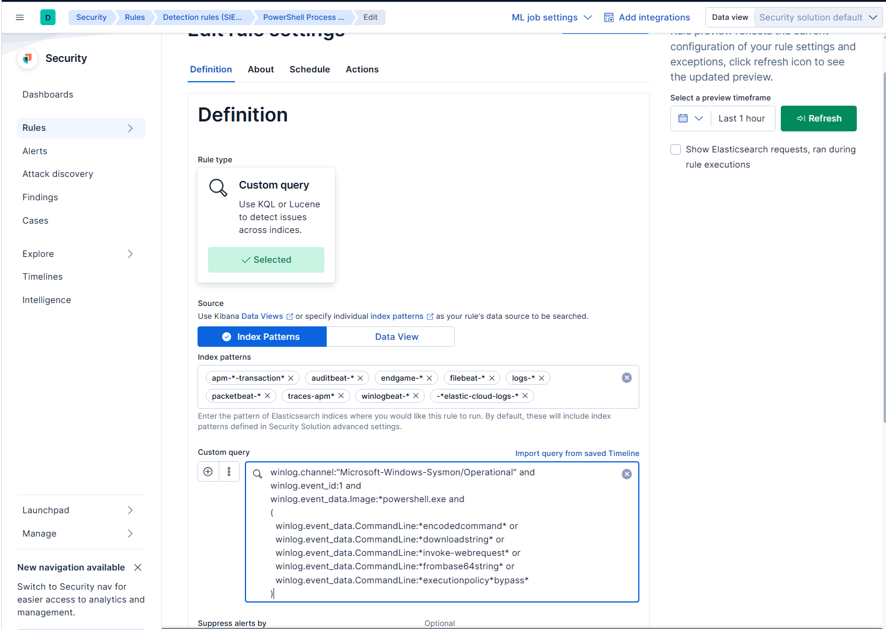
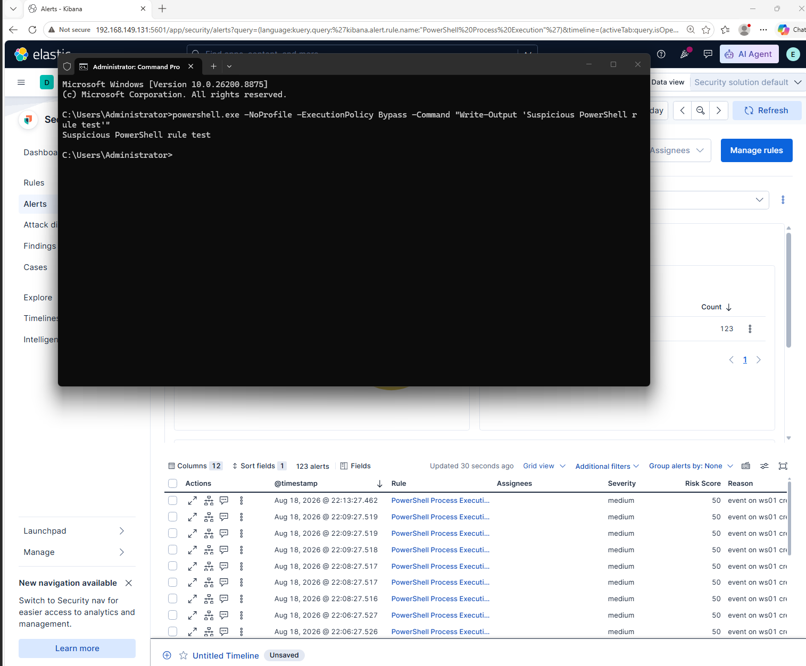
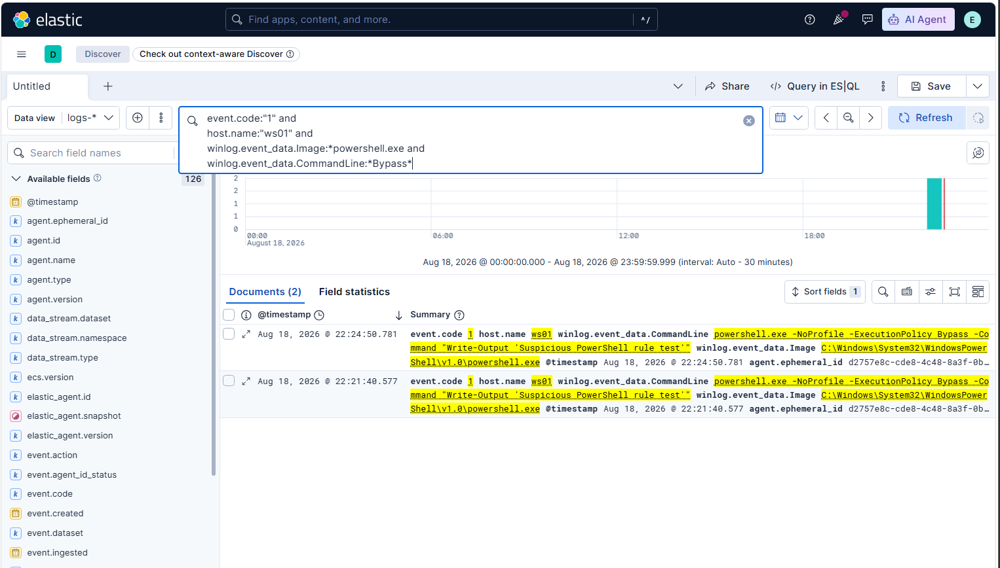

# PowerShell Execution Policy Bypass Detection

## Overview

This detection identifies PowerShell processes launched with the `ExecutionPolicy Bypass` argument. Attackers may use this option to run scripts while avoiding the system’s configured PowerShell execution-policy restrictions.

## Rule Information

| Field                  | Value                              |
| ---------------------- | ---------------------------------- |
| Rule name              | PowerShell Execution Policy Bypass |
| Data source            | Microsoft Sysmon                   |
| Event type             | Process Creation                   |
| Sysmon Event ID        | 1                                  |
| Endpoint               | WS01                               |
| SIEM platform          | Elastic Security                   |
| Severity               | Medium                             |
| Risk score             | 50                                 |
| MITRE ATT&CK tactic    | Execution                          |
| MITRE ATT&CK technique | T1059.001 — PowerShell             |

## Detection Logic

```kql
winlog.channel:"Microsoft-Windows-Sysmon/Operational" and
winlog.event_id:1 and
winlog.event_data.Image:*powershell.exe and
winlog.event_data.CommandLine:*Bypass*
```

## Test Command

The following harmless command can be executed on the Windows test endpoint to generate the required telemetry:

```powershell
powershell.exe -ExecutionPolicy Bypass -Command "Write-Output 'SOC detection test'"
```

This command does not download or execute malicious content. It is used only to validate that Sysmon records the command line and that Elastic receives the event.

## Validation Procedure

1. Execute the controlled test command on `WS01`.
2. Open Kibana Discover.
3. Set the time range to include the test execution.
4. Search for Sysmon Event ID 1 events involving `powershell.exe`.
5. Confirm that the process image and command-line fields are populated.
6. Add the `Bypass` command-line condition.
7. Save and enable the detection rule in Elastic Security.
8. Review generated alerts and verify the source host, user, parent process, and complete command line.

## Investigation Workflow

When the rule generates an alert, the analyst should review:

* Source hostname and logged-on user
* Complete PowerShell command line
* Parent and child processes
* Script or file paths referenced by the command
* Network connections associated with the process
* Encoded or obfuscated command content
* Related alerts from the same endpoint
* Whether the activity was initiated by an administrator or approved management tool

## Potential False Positives

Legitimate administrators, deployment tools, software installers, and automation scripts may use `ExecutionPolicy Bypass`. Analysts should validate the user, parent process, script path, and business purpose before escalating the event.

## Troubleshooting Findings

During validation, the complete query initially returned no results. Troubleshooting began with the broader baseline query:

```kql
winlog.event_id:1 and
winlog.event_data.Image:*powershell.exe
```

After confirming that PowerShell process-creation events were present, the channel and command-line filters were tested separately.

This troubleshooting approach helps determine whether the issue is caused by:

* An incorrect time range
* Delayed event ingestion
* Missing command-line telemetry
* A field-name or field-mapping difference
* Case-sensitive or overly restrictive search logic

## Recommended Response

If the activity is unauthorized or suspicious:

1. Isolate the affected endpoint.
2. Preserve the complete process and command-line telemetry.
3. Identify any scripts, payloads, or downloaded files.
4. Review related network and authentication activity.
5. Search the environment for the same command or indicators.
6. Terminate malicious processes and remove persistence.
7. Reset exposed credentials when credential access is suspected.
8. Document the investigation and remediation actions.

## Detection Status

**Status:** Created and tested in the Enterprise SOC Home Lab.

## Evidence

### Suspicious PowerShell Detection Logic

The custom rule searches Sysmon process-creation events for PowerShell command lines containing potentially suspicious indicators.



### Controlled Execution Policy Bypass Test

A harmless PowerShell command was executed on `WS01` with the `ExecutionPolicy Bypass` argument.



### Kibana Discover Validation

Kibana Discover returned two matching Sysmon Event ID 1 records. The results confirmed that the complete command line, `ExecutionPolicy Bypass` argument, PowerShell image path, and source host were successfully ingested.


