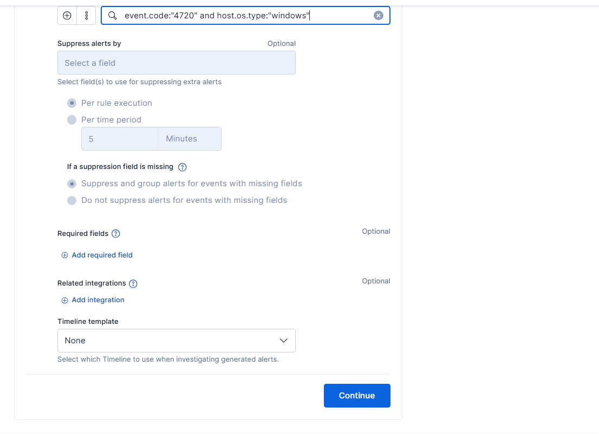
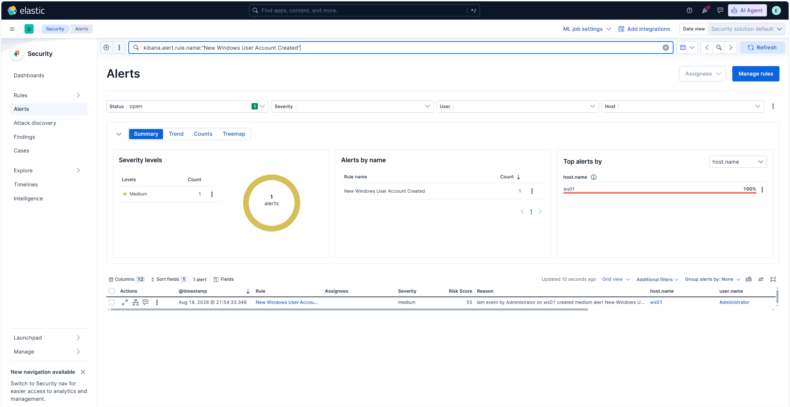
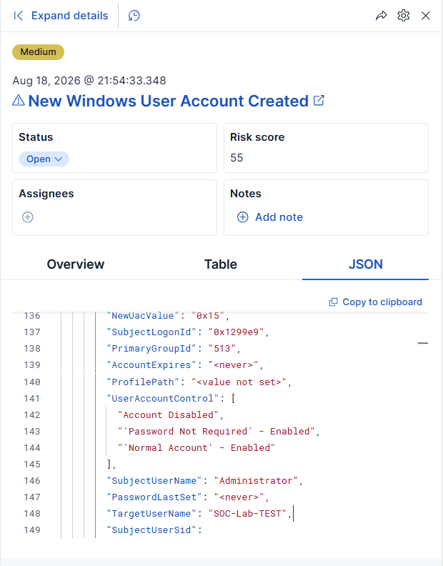
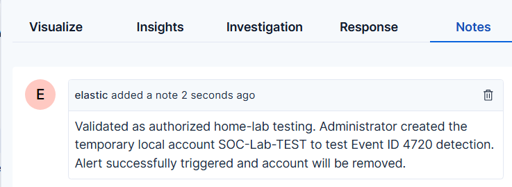

# New Windows User Account Creation Detection

## Overview

This detection identifies the creation of a new Windows user account by monitoring Windows Security Event ID 4720. Unexpected account creation can indicate persistence, privilege escalation preparation, or unauthorized administrative activity.

## Rule Information

| Field                  | Value                                     |
| ---------------------- | ----------------------------------------- |
| Rule name              | New Windows User Account Created          |
| Data source            | Windows Security audit logs               |
| Windows Event ID       | 4720                                      |
| Endpoint               | WS01                                      |
| SIEM platform          | Elastic Security                          |
| Severity               | Medium                                    |
| Risk score             | 55                                        |
| MITRE ATT&CK tactic    | Persistence                               |
| MITRE ATT&CK technique | T1136.001 — Create Account: Local Account |

## Detection Logic

```kql
event.code:"4720" and host.os.type:"windows"
```

This query detects Windows account-creation events across monitored Windows endpoints.

## Controlled Test

A temporary local account named `SOC-Lab-TEST` was created on `WS01` to generate Windows Security Event ID 4720. After the alert was validated and investigated, the test account was deleted.

Example test syntax:

```cmd
net user SOC-Lab-TEST <StrongTemporaryPassword> /add
```

The password used during testing is intentionally excluded from this public repository.

## Validation Procedure

1. Create a temporary local account on the Windows test endpoint.
2. Confirm that Windows records Security Event ID 4720.
3. Verify that Elastic Agent forwards the event.
4. Search for the event in Kibana.
5. Confirm the initiating user, target username, hostname, and timestamp.
6. Verify that the Elastic detection rule generates an alert.
7. Investigate and document the activity.
8. Delete the temporary account after testing.

## Investigation Workflow

When this rule generates an alert, the analyst should review:

* Name of the newly created account
* Account responsible for creating it
* Source hostname
* Event timestamp
* Account-control attributes
* Group-membership changes
* Subsequent authentication activity
* Other account-management events
* Whether the activity was authorized
* Whether the account was later disabled or deleted

## Potential False Positives

Legitimate account creation may result from:

* Approved administrator activity
* Help-desk provisioning
* System deployment processes
* Application installation
* Authorized service-account creation
* Automated identity-management tools

The analyst should verify the change request and business justification before closing the alert.

## Recommended Response

If the account creation is unauthorized:

1. Disable or remove the newly created account.
2. Isolate the affected endpoint when compromise is suspected.
3. Review the privileges and group memberships assigned to the account.
4. Investigate activity performed by both the creator and new account.
5. Search for similar account-creation events across the environment.
6. Reset potentially compromised administrator credentials.
7. Review persistence mechanisms and related authentication events.
8. Document the findings and remediation actions.

## Evidence

### Detection Query

The Elastic custom query monitors Windows systems for account-creation Event ID 4720.



### Generated Alert

Elastic Security generated a medium-severity alert for the newly created account on `WS01`.



### Alert Details

The alert JSON identifies `Administrator` as the initiating account and `SOC-Lab-TEST` as the newly created target account.



### Investigation Documentation

The alert was documented as authorized home-lab testing. The note records the test purpose, successful alert generation, and planned removal of the temporary account.



## Detection Status

**Status:** Successfully created, triggered, investigated, documented, and remediated in the Enterprise SOC Home Lab.
