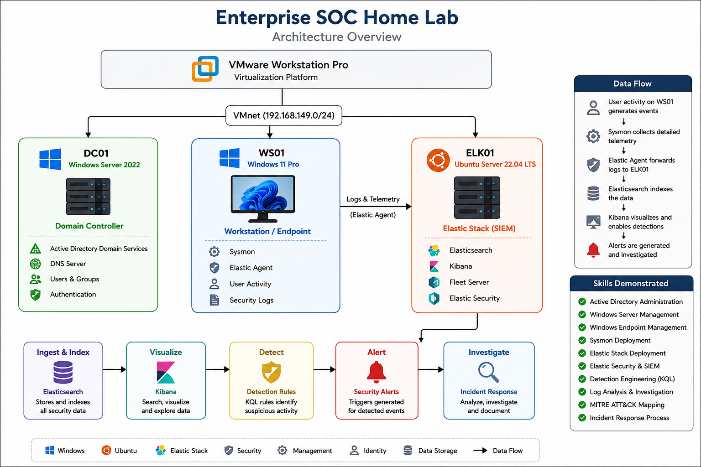
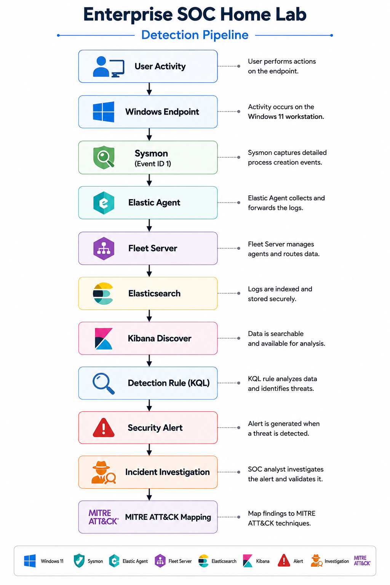

# 🛡️ Enterprise SOC Home Lab


---

# Enterprise Security Operations Center (SOC) Home Lab

## Overview

This project demonstrates the design, deployment, and operation of a simulated Enterprise Security Operations Center (SOC) using industry-standard security tools and enterprise infrastructure.

The lab was built to simulate a real-world corporate environment where endpoint telemetry is collected, centralized, analyzed, detected, and investigated using Elastic Security.

The objective of this project is to demonstrate hands-on experience with:

- Security Monitoring
- Detection Engineering
- Threat Hunting
- Incident Response
- Active Directory Administration
- Endpoint Logging
- SIEM Investigation
- MITRE ATT&CK Mapping

---





---

# Technologies Used

| Technology | Purpose |
|------------|---------|
| VMware Workstation Pro | Virtualization Platform |
| Windows Server 2022 | Active Directory Domain Controller |
| Windows 11 | Endpoint Workstation |
| Ubuntu Server | Elastic Stack |
| Elastic Security | SIEM Platform |
| Elasticsearch | Log Storage |
| Kibana | Visualization & Investigation |
| Fleet | Agent Management |
| Elastic Agent | Log Collection |
| Sysmon | Endpoint Telemetry |
| PowerShell | Administrative Testing |
| MITRE ATT&CK | Threat Mapping |
| KQL | Detection Queries |

---

# Skills Demonstrated

- Security Operations Center (SOC)
- SIEM Administration
- Elastic Security
- Detection Engineering
- Threat Hunting
- Incident Investigation
- Active Directory
- Windows Administration
- Endpoint Security
- Sysmon Configuration
- Fleet Management
- KQL Query Development
- Log Analysis
- MITRE ATT&CK Mapping
- Security Documentation

---

# Documentation

| Document | Description |
|----------|-------------|
| [📄 Architecture Overview](Architecture/README.md) | Enterprise SOC architecture |
| [📄 Network Diagram](Architecture/Network-Diagram.md) | Network topology |
| [📄 Detection Rule](docs/Detection-Rule-Suspicious-PowerShell.md) | PowerShell detection engineering |
| [📄 Threat Hunting Report](docs/Threat-Hunting-Report.md) | Threat hunting methodology |
| [📄 Incident Report](Incident-Reports/IR-001-PowerShell-Process-Detection.md) | Incident investigation workflow |
| [📄 Virtual Machines](Architecture/Virtual-Machines.md) | Virtual machine configuration |
---

# Enterprise Environment

## Infrastructure

- Domain Controller (DC01)
- Windows 11 Endpoint (WS01)
- Ubuntu Elastic Server
- Fleet Server
- Elasticsearch
- Kibana

---

# Security Monitoring Workflow

```
User Activity
      │
      ▼
Windows Endpoint
      │
      ▼
Sysmon
      │
      ▼
Elastic Agent
      │
      ▼
Fleet Server
      │
      ▼
Elasticsearch
      │
      ▼
Kibana
      │
      ▼
Detection Rule
      │
      ▼
Security Alert
      │
      ▼
Threat Hunting
      │
      ▼
Incident Investigation
```

---

# MITRE ATT&CK Coverage

| Tactic | Technique |
|----------|-----------|
| Execution | PowerShell (T1059.001) |
| Execution | Command & Scripting Interpreter |
| Defense Evasion | Living-off-the-Land Binaries |
| Initial Access | User Execution |
| Command & Control | Ingress Tool Transfer |

---

# Repository Structure

```
Enterprise-SOC-Home-Lab
│
├── docs
│   ├── Detection-Rule-Suspicious-PowerShell.md
│   ├── Threat-Hunting-Report.md
│   ├── Incident-Report.md
│   └── Network-Diagram.md
│
├── images
│   ├── architecture
│   ├── dashboards
│   ├── detection-rule
│   └── incident-response
│
├── virtual-machines
│
└── README.md
```

---

# Future Enhancements

- Windows Event Forwarding (WEF)
- Sysmon Configuration Tuning
- Sigma Rule Integration
- Additional Detection Rules
- Malware Analysis
- Atomic Red Team Testing
- ATT&CK Coverage Expansion
- Automated Alerting
- SOAR Integration
- Threat Intelligence Feeds

---

# Project Outcomes

This lab successfully demonstrates practical experience with enterprise security monitoring, centralized logging, endpoint detection, threat hunting, incident response, and detection engineering.

The project closely mirrors workflows performed by Security Operations Center (SOC) analysts and provides a foundation for future security engineering and threat detection projects.
